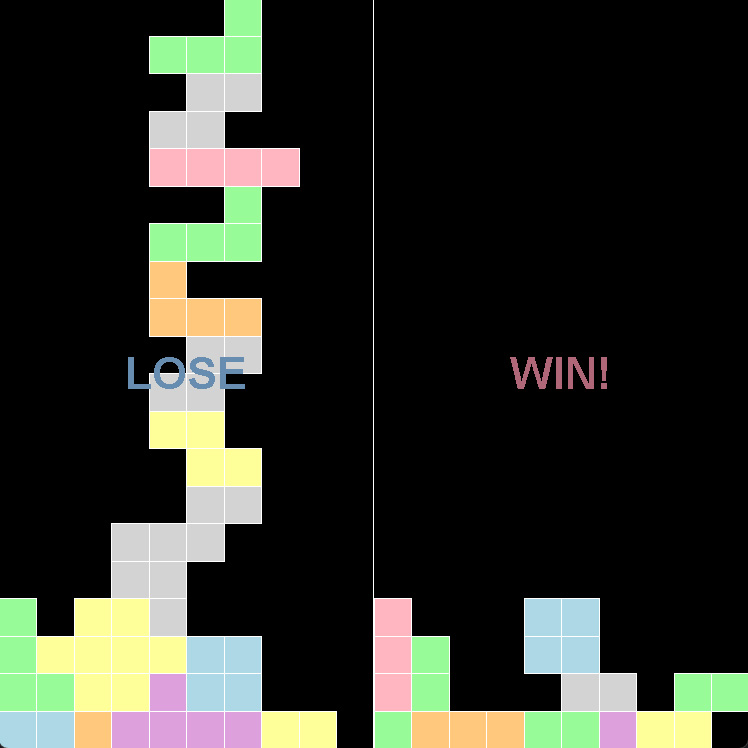
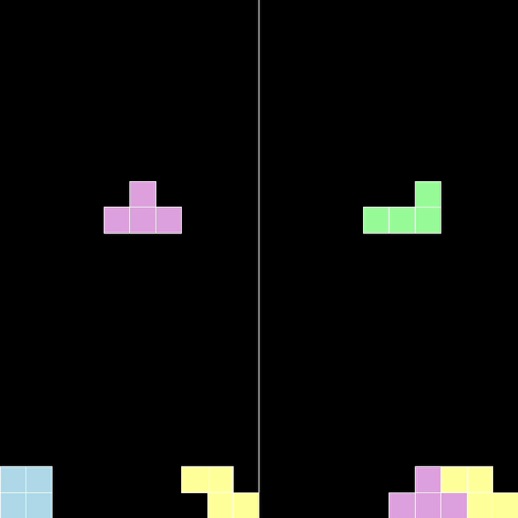

# 🎮 2人対戦ブロックバトル - Javaversion

 

## 🧩 概要

  
パステルカラーのブロックで、1台のキーボードを使ってふたりでブロック落としの対戦ができます。

## 制作意図

Javaの記述練習のためSwingで制作しました。
記述練習で行き当たりばったりなので今回は設計図等はありません。

## ▶️ 実行方法

### 🔧 コンパイル（ターミナル）

同じディレクトリにある `.java` ファイルは依存関係を自動で解決してコンパイルされます。
```bash
javac TwoPlayerBlock.java
```
または、すべての .java ファイルを一括コンパイルすることも可能です。
```bash
javac *.java
```
実行
```bash
java TwoPlayerBlock
```

## 💻 動作環境

- **Java**：バージョン 8 以上
- **GUI**：Java Swing（AWT イベント）
- **タイマー処理**：`javax.swing.Timer` を使って500msごとに自動落下✨
- **画面構成**：`JFrame`＋`GridLayout(1, 2)`で2人分のプレイ画面を並べてます。

## 🕹️ プレイ方法

### 🚀 プレイ動画（GIF）

ゲームのプレイデモです！どんな感じで遊べるか見てください。



### 🎮 操作方法

### 🎮 操作方法

| プレイヤー  | キー操作               | 説明       |
|-------------|------------------------|------------|
| Player 1    | A / D / S / W          | ← → ↓ 回転 |
| Player 2    | ← / → / ↓ / ↑ (矢印キー) | ← → ↓ 回転 |

## 📁 ファイル構成

| ファイル名             | 説明                             |
|------------------------|----------------------------------|
| `TwoPlayerBlock.java`  | ゲームのエントリーポイント🎮      |
| `BlockBoard.java`      | 各プレイヤーの盤面クラス   |
| （他に画像などは不要） | GUI描画はすべてJavaで完結         |

## 📱 対応環境

- PC推奨（スマホは2人対戦操作に非対応）

## 🐣 今後のアイデア

- スコア表示／記録
- 対戦BGM追加
- 1人プレイモード

## 📜 ライセンス

このアプリは個人の学習目的で作成されたものであり、**商用利用を禁止**しています。  
その他の利用条件については、[LICENSE](./LICENSE) ファイルをご確認ください。


## 🙌 クレジット
- 開発: eri


